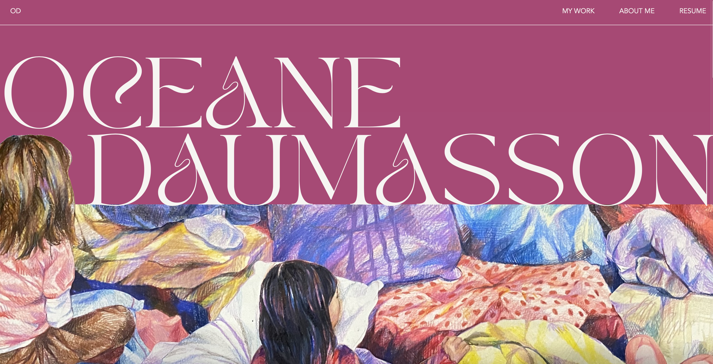
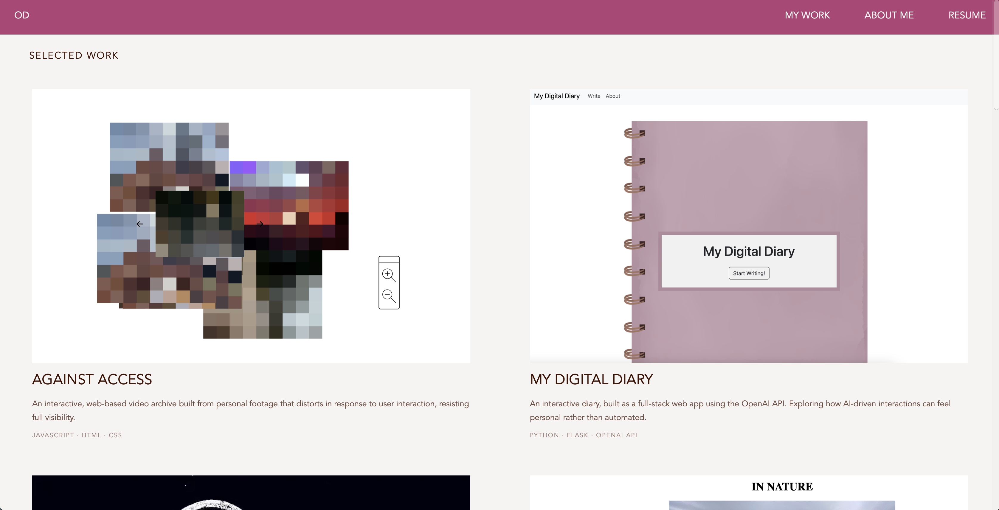
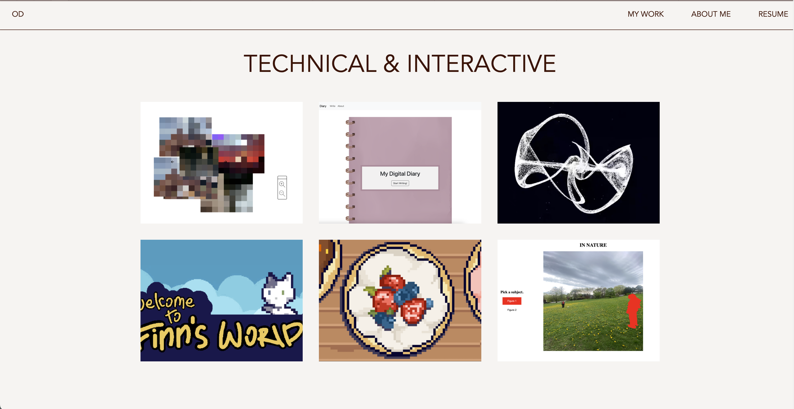

# Oceane Daumasson | Portfolio
 
My personal portfolio, designed and built from scratch

## Check it out here!
**[Live site](https://oceanedaumasson.netlify.app)**

## Screenshots

 
## About
A showcase of my work across web development, generative systems, game development, and design. I'm a Computer Science and Computation Arts student at Concordia University, and I wanted the site to reflect both sides of that, handwritten code and a unique visual identity.
 
## Features
- Hand-written, intuitive and responsive layout, with a mobile layout for phones
- Homepage with a featured "Selected Work" grid, plus a full My Work page
- Individual project pages with descriptions, key features, and media
- Reusable navigation bar built as a custom web component in JavaScript, shared across every page
- Hover effects to go between pages
- Smooth-scrolling section links

## Built with
HTML, CSS, JavaScript. Hosted on Netlify.
